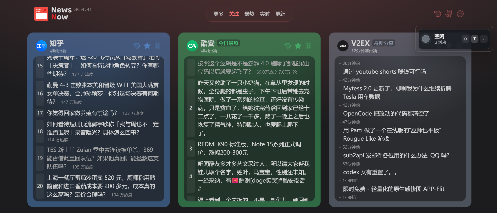
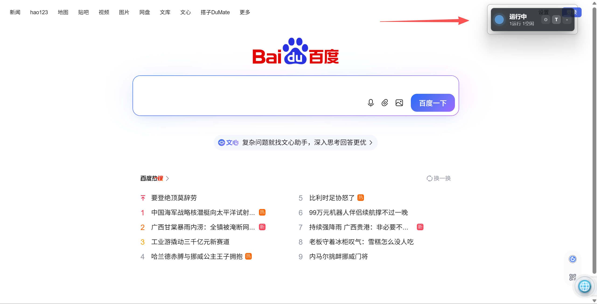

# indicator

`indicator` 是一个本机桌面状态指示器，用来把 Codex / AI Agent 的运行状态放到屏幕角落和系统托盘里。它基于 Tauri 2、TypeScript 和 Rust 构建，优先面向 Windows 使用场景，同时保留 Tauri 的跨平台基础。

当前项目已经不是 Tauri + Vue 模板，而是一个 plain TypeScript 多页面前端加 Rust 后端的小工具：

- 主窗口显示当前状态、来源、摘要和最近事件。
- 系统托盘提供显示/隐藏、设置、打开目录和退出入口。
- Codex hook bridge 将权限请求、完成、中断和异常等事件写入本机状态文件。
- 后端会读取状态文件、事件文件，并结合 Codex sessions 推断一个或多个 Codex 实例状态。
- 设置窗口支持常规窗口行为、状态目录、Codex sessions 目录、多实例显示、轮询频率和状态动效配置。





## 功能亮点

- **悬浮小窗**：默认 220px 宽，透明、置顶、跳过任务栏，适合放在屏幕边缘观察状态。
- **贴边收纳**：拖到屏幕左、右或上边缘后可收成状态灯珠，悬停时滑出完整面板。
- **状态展示**：支持空闲、运行中、等待批准、已完成、异常和中断等状态；多个 Codex 会话会聚合成一盏总状态灯。
- **最近事件**：展开主面板后查看最近写入的事件记录。
- **系统托盘**：托盘菜单可显示/隐藏主窗口、打开设置、打开状态/日志目录。
- **设置窗口**：独立设置页，不挤占主悬浮窗空间；每个配置项都有用途和兼容性说明。
- **路径配置**：可使用自动目录，也可指定状态目录和 Codex sessions 目录。
- **状态动效**：运行中呼吸灯、状态切换闪烁等效果可在设置里调整。

## 状态来源

应用会综合三类本机数据判断状态。一个活跃的 Codex session jsonl 文件会被视作一个实例，主窗口折叠时显示聚合状态，展开后显示各实例状态。

1. `state/status.json`
   - 当前状态快照。
   - 主要由 `hooks/agent-status-bridge.ps1` 写入。
   - 用于表达等待批准、已完成、异常、中断等明确状态。
   - 新版本还会读取 `state/status/*.json`，用于区分多个实例的 bridge 状态。

2. `state/events.jsonl`
   - 最近事件流水，每行一个 JSON 事件。
   - 主面板的最近事件列表从这里读取。
   - 多实例事件会额外带上实例标识和工作目录，便于在列表中区分来源。

3. Codex sessions
   - 默认从用户目录下的 `.codex/sessions` 自动检测。
   - Rust 后端会解析最近活跃的会话文件，用于推断每个 Codex 实例是否仍在运行、是否等待输入或是否被中断。

状态文件和 sessions 推断会一起参与最终展示。聚合状态优先级为：等待输入、异常、中断、运行中、已完成、空闲；普通状态下会用 sessions 补充运行中判断。

## 快速开始

环境要求：

- Node.js
- Rust 工具链
- Windows 上构建安装包时，需要额外准备 Tauri / WiX 相关环境；仅构建可执行文件可先使用 `--no-bundle`。

安装依赖：

```powershell
npm install
```

开发运行：

```powershell
npm run tauri dev
```

前端类型检查和构建：

```powershell
npm run build
```

本地 release 可执行文件构建，不打安装包：

```powershell
npm run tauri build -- --no-bundle
```

## Codex Hook 接入

仓库内置了一个 PowerShell bridge：

```text
hooks/agent-status-bridge.ps1
```

它的职责是接收 Codex hook / notify 输入，转换为 indicator 可读取的状态文件和事件文件：

- 写入 `state/status.json` 和 `state/status/<实例键>.json`
- 追加 `state/events.jsonl`
- 必要时写入 `logs/indicator.log`

推荐通过环境变量告诉脚本当前项目目录：

```powershell
$env:INDICATOR_PROJECT_ROOT = "D:\Code\Tauri\indicator"
```

然后在你的 Codex hook 或通知脚本中调用：

```powershell
powershell -ExecutionPolicy Bypass -File "D:\Code\Tauri\indicator\hooks\agent-status-bridge.ps1"
```

本 README 不提供自动改写全局 Codex 配置的命令。不同机器上的 Codex 配置路径、已有通知脚本和 hook 策略可能不同，建议把上面的 bridge 作为现有 hook 链路中的一步接入。

## 配置说明

设置窗口可从托盘菜单打开。当前配置会持久化到应用数据目录下的 `config/settings.json`。

主要配置包括：

- **语言**：当前默认中文，保留英文选项用于后续扩展。
- **主题**：设置窗口支持跟随系统、浅色和深色。
- **启动后显示主窗口**：关闭后应用仍可从托盘重新显示。
- **窗口置顶**：保存后会立即尝试应用到主悬浮窗。
- **记住窗口位置**：依赖窗口状态插件和系统窗口管理器。
- **隐藏到托盘**：主窗口隐藏后应用继续在托盘中运行。
- **面板展开高度**：控制最近事件列表展开后的高度。
- **贴边收纳**：开启后可把主窗口拖到屏幕左、右或上边缘收成状态灯珠。
- **收起延迟**：控制鼠标离开贴边展开面板后多久收回灯珠，范围 200-3000ms。
- **状态目录模式 / 状态目录**：自动使用应用数据目录，或改为自定义目录。
- **Codex sessions 目录模式 / Codex sessions 目录**：自动寻找 `~/.codex/sessions`，或改为自定义 sessions 目录。
- **轮询频率**：主面板读取状态的间隔，最低限制为 250ms。
- **实例活跃窗口**：控制多久未更新的 Codex session 会从实例列表中消失，默认 10 分钟。
- **运行判定窗口**：控制 session 文件多少秒内有写入才算“运行中”，默认 120 秒。
- **显示实例列表**：控制展开面板顶部是否显示活跃实例列表。
- **事件行实例前缀**：控制最近事件是否显示项目名前缀，方便多实例区分来源。
- **完成后短暂显示**：Codex 完成后保持“已完成”状态一段时间再回到空闲。
- **运行中呼吸灯 / 状态切换闪烁**：控制本地视觉动效，不影响原始状态文件。

如需排查路径问题，可在设置窗口打开诊断信息，查看当前设置文件、状态目录、日志目录和 Codex sessions 目录。

## 项目结构

```text
.
├─ hooks/
│  └─ agent-status-bridge.ps1      # Codex hook / notify 到状态文件的桥接脚本
├─ src/
│  ├─ main.ts                      # 前端入口，按窗口类型分发
│  ├─ mainPanel.ts                 # 主悬浮窗逻辑
│  ├─ settingsPage.ts              # 独立设置页逻辑
│  ├─ settingsModel.ts             # 设置默认值、元数据和归一化
│  ├─ statusPresenter.ts           # 状态展示文案和样式映射
│  └─ style.css                    # 主窗口和设置窗口样式
├─ src-tauri/
│  ├─ src/lib.rs                   # Tauri 后端、状态读取、tray 和窗口命令
│  └─ tauri.conf.json              # Tauri 应用配置
├─ state/
│  └─ .gitkeep                     # 本地状态目录占位
├─ logs/
│  └─ .gitkeep                     # 本地日志目录占位
└─ tests/                          # Node 侧轻量回归测试
```

## 开发与验证

常用验证命令：

```powershell
npm run test:bridge
npm run test:dock
npm run test:settings
npm run test:settings-page
npm run test:ui
cargo test --manifest-path src-tauri/Cargo.toml
```

构建验证：

```powershell
npm run build
npm run tauri build -- --no-bundle
```

如果只是修改文档，不需要运行完整构建；修改前端、Rust 后端、hook bridge 或设置模型时，建议至少跑对应测试。

## 排障

### 状态不更新

先确认 bridge 是否写入了状态文件：

```powershell
Get-Content .\state\status.json
Get-ChildItem .\state\status
Get-Content .\state\events.jsonl -Tail 20
```

如果文件没有变化，检查 Codex hook 是否真的调用了 `hooks/agent-status-bridge.ps1`，以及 `INDICATOR_PROJECT_ROOT` 是否指向当前项目目录。

### 一直显示空闲

可能原因：

- `state/status.json` / `state/status/*.json` 不存在或内容不可读。
- 状态文件中没有明确状态，且 Codex sessions 目录没有可解析的活动会话。
- 设置中的 Codex sessions 目录指向了错误位置。

可在设置窗口打开诊断信息，确认状态目录和 Codex sessions 目录。

### 最近事件为空

最近事件来自 `state/events.jsonl`。如果主状态能变化但事件列表为空，检查 bridge 是否有权限写入 `state/` 目录，以及 `logs/indicator.log` 是否记录了写入错误。

### 设置没有生效

设置保存在应用数据目录下的 `config/settings.json`。如果设置文件损坏，应用会回退默认配置，并在设置页显示读取错误。可以在设置页使用“恢复默认设置”重新生成。

### 收纳后找不到窗口

贴边收纳后主窗口只保留屏幕左、右或上边缘的一颗状态灯珠。把鼠标停在灯珠上会展开完整面板；也可以通过系统托盘的“显示/隐藏”重新显示主窗口。如果不想使用该行为，在设置窗口关闭“贴边收纳”即可恢复普通悬浮。

### 构建 MSI / 安装包失败

Windows 安装包依赖 WiX 工具链。如果 `npm run tauri build` 在打包阶段失败，但：

```powershell
npm run tauri build -- --no-bundle
```

可以生成 `src-tauri\target\release\indicator.exe`，通常说明业务代码和基础 release 构建没有问题，失败点更可能在本机 WiX / MSI 打包环境。

## 隐私说明

`indicator` 只读取和写入本机文件。状态、事件、设置和日志默认保存在本机应用数据目录或你配置的本地目录中，不会上传到外部服务。

需要注意：`events.jsonl` 和 `indicator.log` 可能包含 Codex hook 传入的摘要、命令片段、路径或错误信息。分享日志前建议先人工检查敏感内容。
